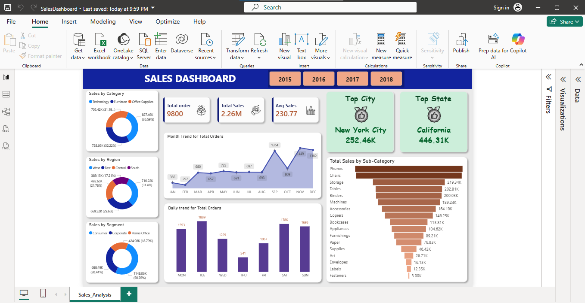

# Sales-Dashboard-PowerBI
Interactive Sales Analysis Dashboard built using Power BI

# Sales Analysis Dashboard | Power BI

## Overview
This project presents an interactive Power BI dashboard designed to analyze sales performance, customer segments, product categories, and regional trends.

## Business Problem
Sales managers need a centralized reporting solution to monitor revenue, order trends, customer segments, and regional performance. This dashboard provides actionable insights to support business decision-making and performance tracking.

## Tools Used
- Power BI
- Power Query
- DAX
- Excel

## Key Metrics
- Total Orders: 9,800
- Total Sales: 2.26M
- Average Sales: 230.77

## Dashboard Features
- Sales by Category
- Sales by Region
- Sales by Segment
- Monthly Trend Analysis
- Daily Trend Analysis
- Top City Analysis
- Top State Analysis
- Product Sub-Category Analysis

## Skills Demonstrated
- Data Analysis
- Data Cleaning
- Data Transformation
- Data Modeling
    Imported and transformed sales data using Power Query.
    Created relationships between tables.
    Built DAX measures for KPI calculations.
    Optimized the data model for reporting performance.
- DAX Measures
    Total Sales = SUM(Sales[Sales])
    Total Orders = COUNT(Sales[Order ID])
    Average Sales = DIVIDE([Total Sales],[Total Orders])
- Dashboard Development
- Data Visualization
- KPI Analysis
- Trend Analysis
- Business Intelligence Reporting
- Sales Performance Analysis
- Power Query

## Dashboard Preview

## Business Insights
- California generated the highest sales revenue.
- New York City was the top-performing city.
- Technology category contributed the largest share of sales.
- Consumer segment accounted for the highest revenue.
- September recorded the highest order volume.

## Download Project Files
The Power BI project file can be downloaded directly from this repository.
Files Included:
- SalesDashboard.pbix
- Sales.csv
- Dashboard Screenshot
Note: GitHub may not preview .pbix files in the browser due to file size limitations. Download the .pbix file and open it in Power BI Desktop to explore the interactive dashboard.

## Project Workflow
1. Data Collection
2. Data Cleaning
3. Data Transformation
4. Data Modeling
5. DAX Calculations
6. Dashboard Development
7. Business Insight Generation

## Data Source
Dataset sourced from Kaggle and used for educational and portfolio purposes.
Source: Sales Dataset

## Author
Asha L J
Aspiring Data Analyst
Skills:
SQL | Power BI | Excel | Data Visualization | Business Intelligence | Data Analysis
